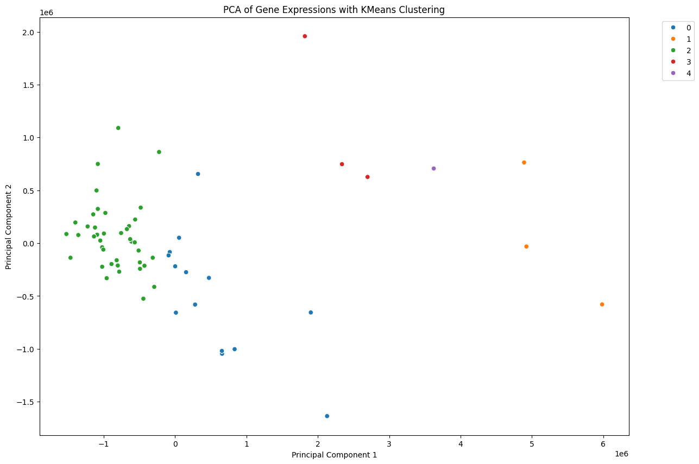
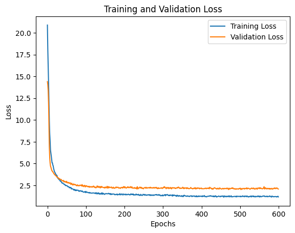
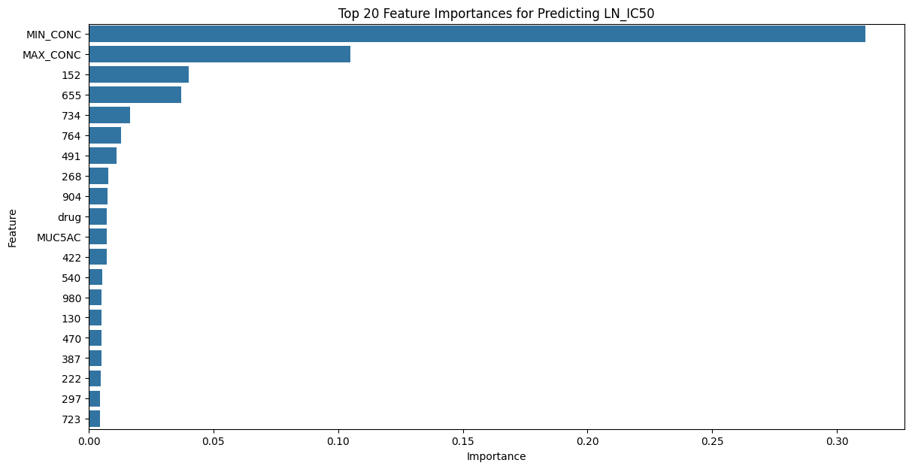
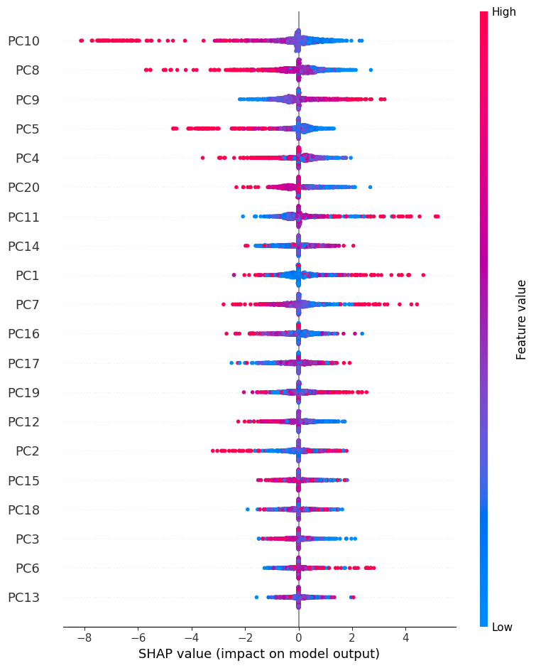

# Predicting patient drug responses

**Using gene expressions, drug SMILES, and advanced deep learning techniques.**

## Group members
1. David Enoma
2. Sasha Chernenkoff
3. Ariel Ghislain Kemogne Kamdoum
4. Mojtaba Kanani Sarcheshmeh

---

## Project overview
This project aims to create predictive models for drug sensitivity in various cancer
cell lines. Utilizing datasets including Cell Model Passports, The Cancer 
Genome Atlas (TCGA), and the Genomics of Drug Sensitivity in Cancer (GDSC) database, we 
integrated genetic and pharmacological data to predict drug efficacy. This endeavor 
combines machine learning, deep learning, and bioinformatics techniques to enhance 
personalized medicine approaches in oncology.

## Data sources
- **Cell Model Passports:** This resource provided a comprehensive collection 
  of cancer cell lines, their genetic profiles, and related metadata. The data 
  included information from multiple cancers, allowing for a diverse and 
  representative dataset.
- **TCGA (The Cancer Genome Atlas):** Provided detailed genomic, epigenomic, 
  transcriptomic, and proteomic data from numerous cancer types. This data was 
  instrumental in understanding the genetic landscape of the cancer cell lines.
- **GDSC (Genomics of Drug Sensitivity in Cancer):** This database contained 
  drug response data, including IC50 values, which measure the effectiveness 
  of drugs in inhibiting cancer cell growth. The data helped to correlate 
  genetic profiles with drug sensitivity.

## Data preparation
### RNAseq data
RNA sequencing data was processed in chunks to manage memory usage efficiently. We 
calculated the variance of gene expressions across all samples to identify the most 
variable (and likely informative) genes for predictive modeling. The top 1,000 genes 
with the highest variance were selected for further analysis.

### Drug response data
Drug response data was merged with SMILES (Simplified Molecular Input Line Entry 
System) strings for drug molecules. These SMILES were converted into Morgan 
fingerprints using RDKit to provide a standardized representation of the chemical 
structure of the drugs. The fingerprints were then scaled for consistency and merged 
with the RNAseq data to form a comprehensive dataset.

## Exploratory data analysis
To better understand the underlying structures in our genetic data before modeling, 
we performed dimensionality reduction and clustering.

Figure: PCA of Gene Expressions with KMeans Clustering

## Model development
We experimented with a variety of machine learning and deep learning models:
- **Multiple Linear Regression (MLR):** A simple linear regression model developed to 
  provide a baseline for comparison.
- **Random Forest Regressor:** An ensemble model trained to predict IC50 values by 
  leveraging multiple decision trees to improve prediction accuracy.
- **Optimized Multi-Layer Perceptron (MLP):** Using Keras Tuner, a hyperparameter 
  search was conducted to optimize a deep learning model to capture non-linear 
  relationships in the data.
- **Multimodal CNN & RNN:** A hybrid architecture developed to process different 
  modalities of data effectively. 
  - A **Convolutional Neural Network (CNN)** branch processed the high-dimensional 
    gene expression data to capture spatial patterns and extract robust features.
  - A **Recurrent Neural Network (LSTM)** branch processed the sequential SMILES 
    encodings of drug compounds to capture structural chemical patterns.
  - The outputs were concatenated with the remaining metadata and passed through a 
    Fully Connected Neural Network (FCNN) to make the final IC50 prediction.

### Hyperparameter tuning
To find the optimal configurations for our deep learning models, we systematically 
tuned architectures using **Keras Tuner** with methods like Random Search and 
Bayesian Optimization. We iteratively adjusted parameters including:
- Number of hidden layers and units per layer (to balance model capacity)
- Dropout ratios and L2 kernel regularization (to mitigate recurring overfitting)
- Learning rates and batch sizes (to manage unstable convergence)
- Early stopping based on validation loss to identify the optimal training duration 
  and ensure generalization to unseen data.

Figure: Training and Validation Loss demonstrating model convergence.

## Results and evaluation
The models were evaluated using Mean Squared Error (MSE), Mean Absolute Error (MAE), 
and R² score to measure their predictive accuracy. The advanced deep learning models 
outperformed the baseline, demonstrating the value of integrating genetic and 
pharmacological data.

**Key Model Performances (Predicting LN_IC50):**
- **Optimized CNN (Best Performing):** MSE = 1.160, R² = 0.832, MAE = 0.810
- **Random Forest Regressor:** MSE = 1.284, R² = 0.814
- **Optimized MLP:** MSE = 1.334, R² = 0.806
- **Multiple Linear Regression (Baseline):** MSE = 1.356, R² = 0.803

The deep learning architectures (specifically the CNN) achieved the lowest MSE, 
successfully capturing the complex interactions between gene expressions and drug 
chemical structures.

Figure: Top 20 Feature Importances for predicting LN_IC50 drug sensitivity.

### Explainable AI (XAI)
To observe the contribution and importance of particular features on the models' 
predictions, we used SHAP (SHapley Additive exPlanations) on our deep models in 
conjunction with:
- **PCA** (for handling linearity and reducing dimensionality)
- **Autoencoders** (for handling non-linearity)

Figure: SHAP Summary plot demonstrating feature contribution to the model's predictions.

## Future work
This project lays the groundwork for more advanced models and larger-scale studies. 
Future directions include:
- Incorporating more complex features from genetic data, such as epigenetic 
  modifications and protein expression levels.
- Exploring other machine learning algorithms and deep learning architectures.
- Applying transfer learning techniques to leverage pre-trained models on similar 
  datasets.
- Conducting prospective validation studies to test the models on new data.

## Conclusion
This project successfully combined extensive datasets and advanced machine learning 
techniques to predict drug sensitivity in cancer cell lines. The integration of 
genetic profiles with pharmacological data provides a robust framework for 
personalized medicine, offering a pathway towards more effective and tailored 
cancer treatments.
